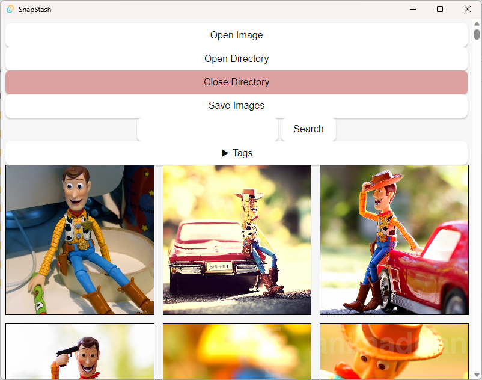

# SnapStash Image Browser

Image browser built with [SDWebUI](https://github.com/AUTOMATIC1111/stable-diffusion-webui) images in mind.

    

## Recommended IDE Setup

[VS Code](https://code.visualstudio.com/) + [Svelte](https://marketplace.visualstudio.com/items?itemName=svelte.svelte-vscode) + [Tauri](https://marketplace.visualstudio.com/items?itemName=tauri-apps.tauri-vscode) + [rust-analyzer](https://marketplace.visualstudio.com/items?itemName=rust-lang.rust-analyzer).

## Features to add:

### Tags:

- Better tag UI
- Search with tags
- Negative tags
- AND/OR with tags
- Add tags to image modal
- UI for adding tags to images
- ~~See tags on image modal~~
- Adding tags to images programmatically (from words in prompt/path)
  - ~~Basic tag extraction from params~~
  - ~~Strict vs loose (exact vs substring)~~
  - Tag aliases (additional keywords per tag)
  - Strict full word match (not full tag match)
- Tag categories

### Images:

- Deleting images
- Resyncing directory
- Moving image files
- Adding description to images

### Settings:

- Add settings page
- Add settings for:
  - Image directory
  - Ignore images by tags (ignored tags)
  - Grid image size
  - Ignore tags by categories

### UI:

- Zoom and pan on image modal
